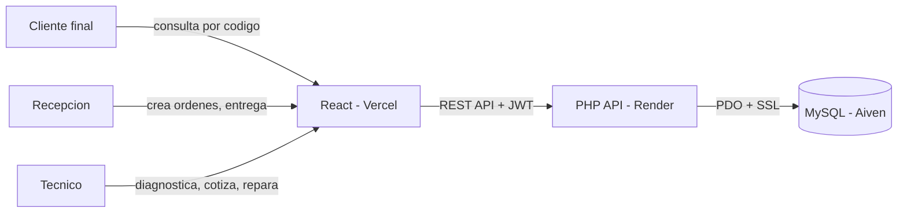
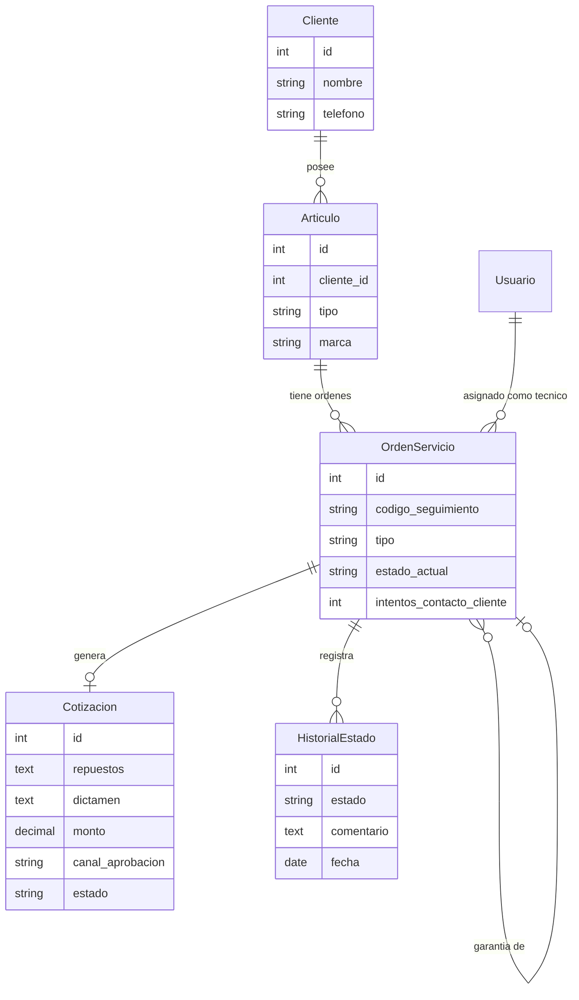
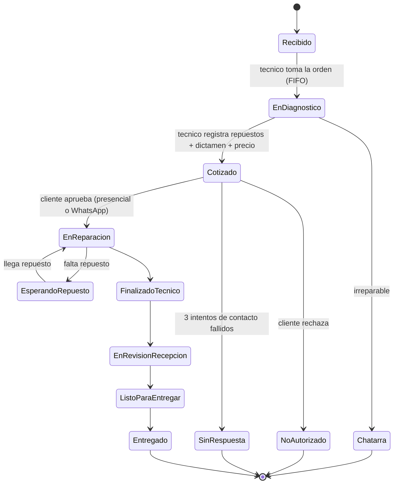

# Expertools — Sistema de trazabilidad de reparaciones

Sistema web para gestionar el ciclo completo de mantenimiento y garantía de artículos (taladros, pulidoras, herramientas eléctricas) en un taller de reparación, con trazabilidad completa del proceso y una página pública de seguimiento para el cliente final.

**Demo en vivo:** https://expertools.vercel.app
(el backend gratuito puede tardar 30-50 segundos en "despertar" en la primera petición tras un rato de inactividad)

**Usuarios de prueba:**
| Rol | Email | Contraseña |
|---|---|---|
| Recepción | admin@test.com | 123456 |
| Técnico | tecnico@test.com | 123456 |

---

## Tabla de contenidos

- [El problema que resuelve](#el-problema-que-resuelve)
- [Stack tecnológico](#stack-tecnológico)
- [Arquitectura](#arquitectura)
- [Modelo de datos](#modelo-de-datos)
- [Máquina de estados](#máquina-de-estados)
- [Cómo correrlo localmente](#cómo-correrlo-localmente)
- [Testing](#testing)
- [CI/CD](#cicd)
- [Infraestructura como código](#infraestructura-como-código)
- [Decisiones técnicas y el pivote de despliegue](#decisiones-técnicas-y-el-pivote-de-despliegue)
- [Pendientes conocidos](#pendientes-conocidos)

---

## El problema que resuelve

Un taller de reparación de herramientas eléctricas llevaba el control de sus órdenes de servicio en Excel, sin forma de que el cliente supiera el estado de su reparación sin llamar o ir físicamente al local. Este sistema:

- Registra cada artículo que ingresa (mantenimiento o garantía)
- Permite al técnico diagnosticar, cotizar (repuestos, dictamen, precio) y reparar
- Registra la respuesta del cliente a la cotización (aprobada, rechazada, o sin respuesta tras 3 intentos de contacto)
- Deja un historial de trazabilidad completo, con fecha y usuario responsable de cada cambio
- Expone una página pública donde el cliente consulta el estado con un código, sin necesidad de cuenta

El flujo de negocio se definió tras varias iteraciones con el dueño real del taller (incluyendo una llamada de voz que corrigió supuestos iniciales incorrectos sobre quién cotiza y cuándo se aprueba una reparación).

## Stack tecnológico

| Capa | Tecnología |
|---|---|
| Backend | PHP 8.2 (sin framework), PDO, JWT (firebase/php-jwt) |
| Frontend | React 18 + Vite, React Router |
| Base de datos | MySQL 8 |
| Testing | PHPUnit |
| Contenedores | Docker, Docker Compose (multi-stage builds) |
| CI/CD | GitHub Actions |
| Infraestructura como código | Terraform (proveedor de Aiven) |
| Hosting (producción) | Render (backend), Vercel (frontend), Aiven (base de datos) — ver [sección de decisiones](#decisiones-técnicas-y-el-pivote-de-despliegue) |

## Arquitectura



## Modelo de datos



## Máquina de estados



La vista pública que ve el cliente agrupa varios de estos estados internos (diagnóstico, cotizado, en reparación, esperando repuesto) bajo un único "En reparación", para no generar confusión.

## Cómo correrlo localmente

Requiere Docker Desktop instalado.

```bash
git clone https://github.com/andrev024/expertools.git
cd expertools
docker compose up --build
```

Esto levanta 3 contenedores: `db` (MySQL con schema y datos de prueba precargados), `backend` (API en `localhost:8000`), y `frontend` (React servido por Nginx en `localhost:5174`).

Para desarrollo del frontend con hot-reload en vez del build de producción:
```bash
cd frontend
npm install
npm run dev
```

## Testing

```bash
cd backend
composer install
vendor/bin/phpunit
```

Cubre la lógica pura de negocio (máquina de estados, generación de códigos de seguimiento) de forma aislada, sin depender de base de datos ni HTTP.

## CI/CD

En cada push a `main`, GitHub Actions (`.github/workflows/ci.yml`):
1. Corre los tests de PHPUnit
2. Verifica que el frontend compile sin errores
3. Si ambos pasan, construye y publica las imágenes Docker en GitHub Container Registry

La entrega continua (CD) a producción la manejan Render y Vercel de forma nativa: ambos redespliegan automáticamente al detectar un push a `main`.

## Infraestructura como código

La base de datos de Aiven fue creada inicialmente de forma manual (interfaz web) y luego **importada** a Terraform (`infra/`), una práctica real de adopción de IaC sobre infraestructura ya existente:

```bash
cd infra
terraform init
terraform plan   # confirma que el estado coincide con la realidad
```

`termination_protection = true` evita que un `terraform apply` accidental destruya la base de datos de producción.

## Decisiones técnicas y el pivote de despliegue

El plan original contemplaba desplegar en una VM de Oracle Cloud administrada con Terraform. Se abandonó ese camino por dos razones concretas:
1. Problemas de disponibilidad ("Out of host capacity") reportados en la región disponible desde Colombia
2. Restricciones de presupuesto que hacían inviable cualquier alternativa con costos, aunque fueran mínimos

Se optó por una arquitectura 100% gratuita, sin tarjeta de crédito, usando servicios administrados (Render, Vercel, Aiven) en vez de una VM propia. Esto sacrifica el control total de una VM (no hay SSH a un servidor propio) a cambio de:
- Cero costo de mantenimiento
- Despliegue automático en cada push (CD "gratis", sin configurar nada)
- Menos superficie de mantenimiento (parches de sistema operativo, seguridad del servidor, etc., los administra el proveedor)

Es una decisión de arquitectura real y defendible: para un negocio pequeño con tráfico bajo, el costo/beneficio de administrar una VM propia no se justifica frente a servicios administrados gratuitos.

## Pendientes conocidos

- Integración real de envío de WhatsApp (actualmente el registro de notificación se guarda en base de datos, sin conexión a la API de WhatsApp Business)
- Generación de recibos imprimibles (ingreso y entrega)
- Pulido visual/UX (ver `docs/pendientes_esteticos.md`)
- Monitoreo activo (uptime monitoring) — evaluado, no implementado por decisión del autor
